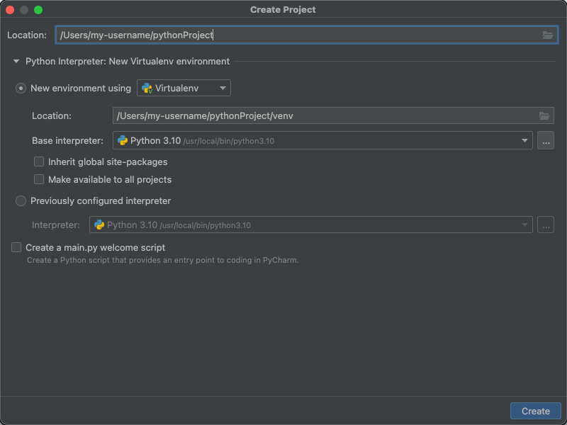
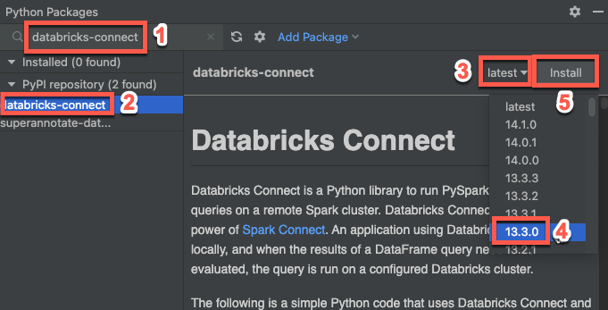

# Databricks Connect
## [Databricks Connect for Python](https://docs.databricks.com/en/dev-tools/databricks-connect/python/index.html)
1. New Project.

2. Add the Databricks Connect package

## [DataGrip integration with Databricks](https://docs.databricks.com/en/dev-tools/datagrip.html)
1. Download the Databricks JDBC Driver
    https://www.databricks.com/spark/jdbc-drivers-download
2. Configure the Databricks JDBC Driver for DataGrip
   - Start DataGrip.
   - Click File > Data Sources.
   - In the Data Sources and Drivers dialog box, click the Drivers tab.
   - Click the + (Driver) button to add a driver.
   - For Name, enter Databricks.
   - On the General tab, in the Driver Files list, click the + (Add) button.
   - Click Custom JARs.
   - Browse to and select the DatabricksJDBC42.jar file that you extracted earlier, and then click Open.
   - For Class, select com.databricks.client.jdbc.Driver.
3. Connect DataGrip to your Databricks databases
   - In DataGrip, click File > Data Sources.
   - On the Data Sources tab, click the + (Add) button.
   - Select the Databricks driver that you added in the preceding step.
   - On the General tab, for URL, enter the value of the JDBC URL field for your Databricks resource. For the JDBC URL field syntax, see Authentication settings for the Databricks JDBC Driver.
   - Click Test Connection.
