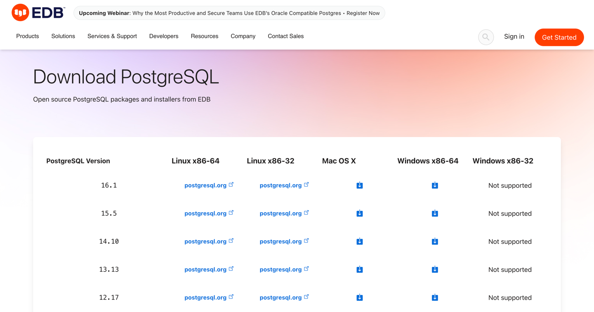
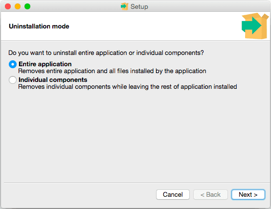

# Installing PostgreSQL

## Installing PostgreSQL on MacOS

### Cài đặt PostgreSQL thông qua [Enterprisedb](https://www.enterprisedb.com/docs/supported-open-source/postgresql/installing/macos/)

1. Tải tệp installers tại [EDB downloads page](https://www.enterprisedb.com/downloads/postgres-postgresql-downloads) hoặc [postgresql.org/download](https://www.postgresql.org/download/macosx/)
   
2. Sau khi cài đặt PostgreSQL, có thể khởi động psql bằng terminal
    ```shell
    # run psql from the default installation directory
    /Library/PostgreSQL/16/bin/psql -U postgres
    ```
3. Add this directory to your PATH to `~/.zshrc` or `~/.bash_profile`
    ```shell
    export PATH="/Library/PostgreSQL/15/bin/:$PATH"
    ```

4. [Uninstalling PostgreSQL](https://www.enterprisedb.com/docs/supported-open-source/postgresql/uninstalling/)
    - Invoke the uninstaller:
      ```shell
      open /Library/PostgreSQL/<version>/uninstall-postgresql.app
      ```

    - Uninstall the entire application
      
    - Respond to the installer
      

5. [Khắc phục sự cố cài đặt](https://www.enterprisedb.com/docs/supported-open-source/postgresql/troubleshooting/)
   tham khảo tệp nhật ký cài đặt `install-postgresql.log` được tạo trong
    ```shell
    # trên Mac OS X
    /tmp
    # trên Windows
    %TEMP%
    ```

### Cài đặt thông qua [Homebrew Formulae](https://formulae.brew.sh/formula/postgresql@16)

```shell
brew install postgresql@16
```

```shell
# Uninstalling PostgreSQL
brew uninstal postgresql@16
```

### Run PostgreSQL trên [docker container](https://hub.docker.com/_/postgres)

File `docker-compose.yaml`

```yaml
services:
    user_service_postgres:
        image: postgres:16.1
        restart: always
        environment:
            POSTGRES_USER: POSTGRES_USER
            POSTGRES_PASSWORD: POSTGRES_PASSWORD
            POSTGRES_DB: POSTGRES_DATABASE
        ports:
            - "5432:5432"
        volumes:
            -   type: volume
                source: user_service_data_store
                target: /var/lib/postgresql/data
                volume:
                    nocopy: true
            - ./config/postgresql.conf:/etc/postgresql/postgresql.conf
        command: [ "-c", "config_file=/etc/postgresql/postgresql.conf" ]
        healthcheck:
            test: [ "CMD-SHELL", "pg_isready -U POSTGRES_USER" ]
            interval: 1m
            timeout: 5s
            start_period: 10s
            retries: 3
        networks:
            rust_network:
                aliases:
                    - user_service_postgres

volumes:
    user_service_data_store:
        driver: local

networks:
    rust_network:
        external: true
        name: rust_network
```

File `postgresql.conf` [Server Configuration PostgreSQL](https://www.postgresql.org/docs/current/runtime-config.html)

```conf
listen_addresses = '*'
shared_buffers=256MB
max_connections=250
```