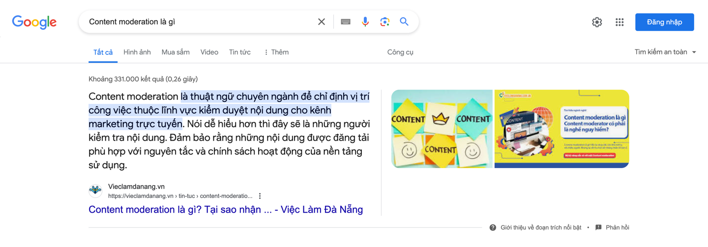

## Content moderation là gì?

<div style="display: flex; justify-content: space-between; align-items: center; align-content: flex-end">
<div style="text-align:left">
    <div style="text-align:left;">HomePage: https://vieclamdanang.vn</div>
</div>
<div style=" display: flex; flex-direction: column; justify-content: center; align-items: flex-end; align-content: center;">
    <div style="text-align:right">23/03/2024</div>
</div>
</div>

---

#### [Content moderation là gì?](https://vieclamdanang.vn/tin-tuc/content-moderation-1245.html)

> Content moderation là gì? Hẳn là công việc còn khá mới lạ với nhiều người. Nhưng lại rất thu hút với những nhân tố Gen
> Z. Khi mà hiện nay, xu hướng truyền thông tiếp thị trực tuyến chiếm vị thế trong lĩnh vực marketing. Nơi nội dung được
> sáng tạo và chia sẻ nhanh chóng, vai trò của họ trở nên rất quan trọng khi kiểm duyệt và điều hướng nội dung. Cùng tìm
> hiểu công việc chính của các Content Moderator trong bài viết sau.


#### Top 1 Google search với từ khoá `Content moderation là gì?` - 23/03/2024

```
Content moderation là gì?
```



