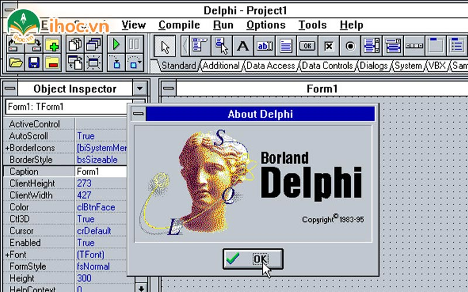
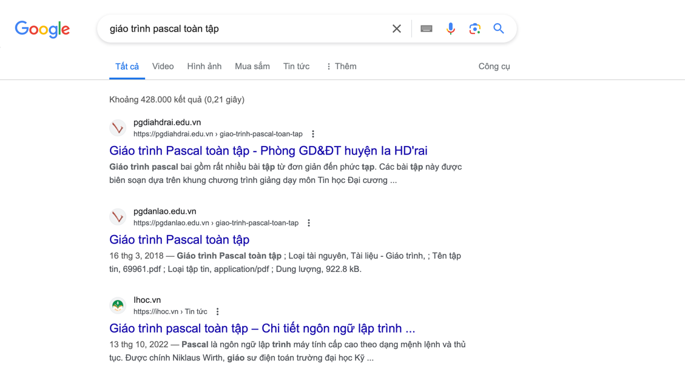

## Giáo trình pascal toàn tập

<div style="display: flex; justify-content: space-between; align-items: center; align-content: flex-end">
<div style="text-align:left">
    <div style="text-align:left;">HomePage: ihoc.vn</div>
</div>
<div style=" display: flex; flex-direction: column; justify-content: center; align-items: flex-end; align-content: center;">
    <div style="text-align:right">23/03/2024</div>
</div>
</div>

---

#### [Giáo trình pascal toàn tập](https://ihoc.vn/tin-tuc/giao-trinh-pascal-toan-tap.html)

> Ngay từ khi ngồi trên ghế nhà trường THCS, các bạn học sinh đã có cơ hội tiếp xúc với ngôn ngữ lập trình pascal. Thế
> nhưng không phải ai cũng hiểu rõ về ngôn ngữ này. Bài viết dưới đây, ihoc.vn đã tổng hợp chi tiết các nguồn kiến thức
> với mục đích có thể tạo ra một giáo trình pascal toàn tập cơ bản. Giúp mọi người có thể tìm hiểu cụ thể hơn ngôn ngữ
> này. Cũng như qua đó sẽ hiểu hơn lý do vì sao ngôn ngữ này được Bộ Giáo Dục lựa chọn để đưa vào chương trình phổ
> thông.


#### Top 3 Google search với từ khoá `giáo trình pascal toàn tập` - 23/03/2024

```
giáo trình pascal toàn tập
```

