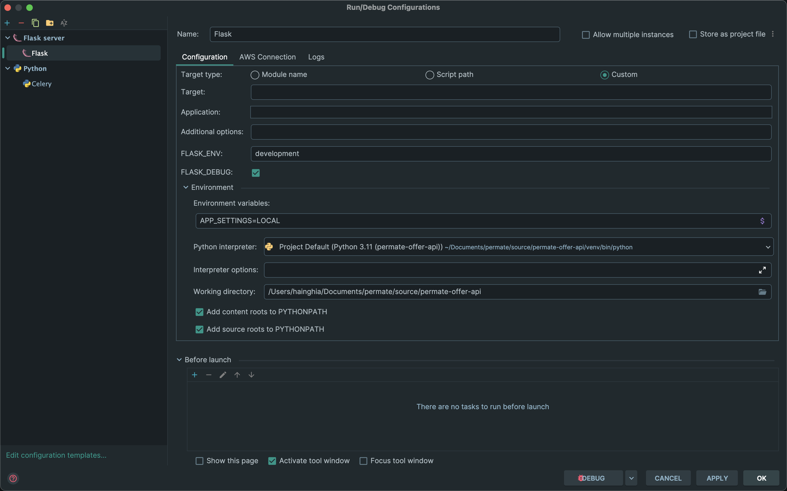
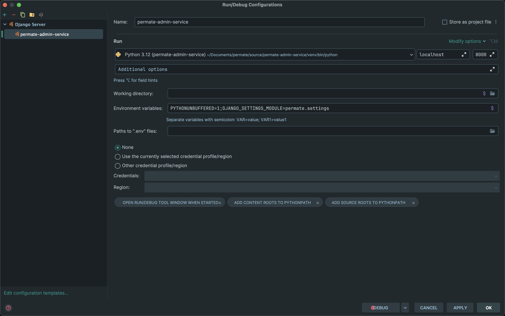
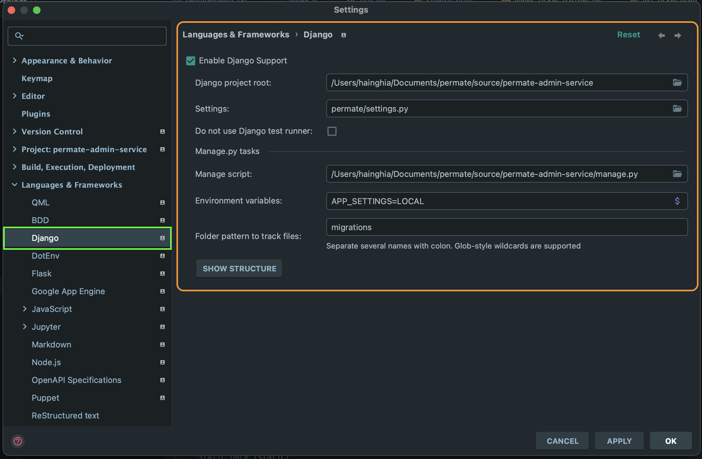
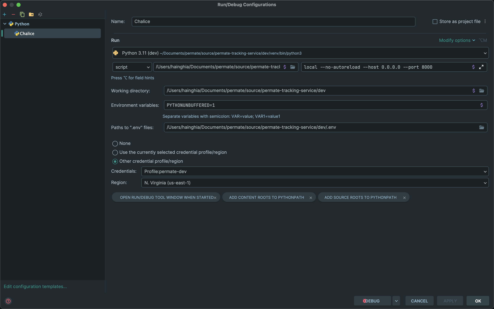
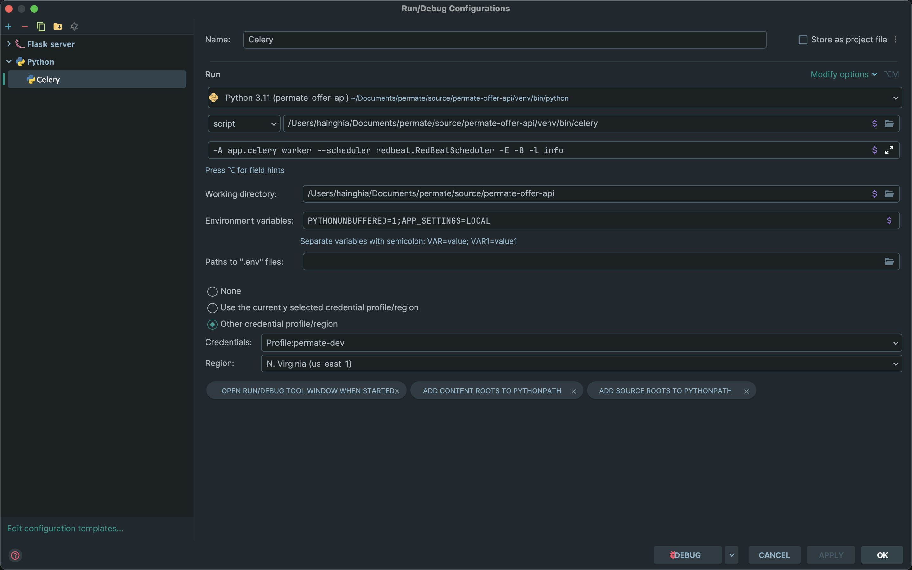
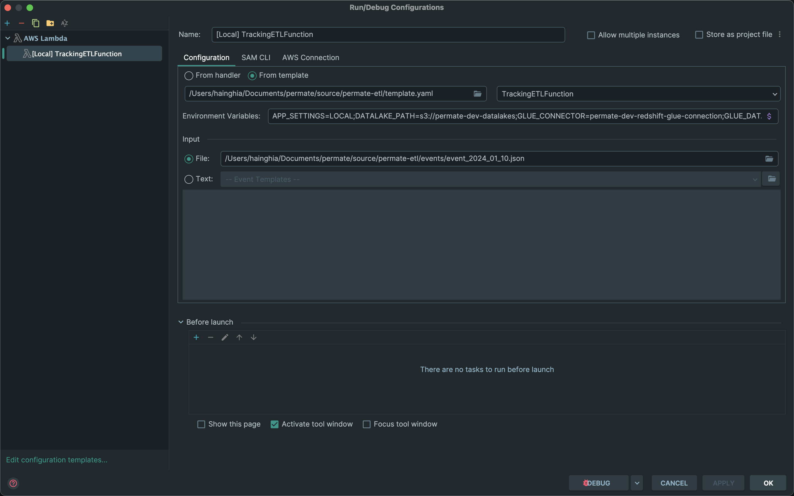
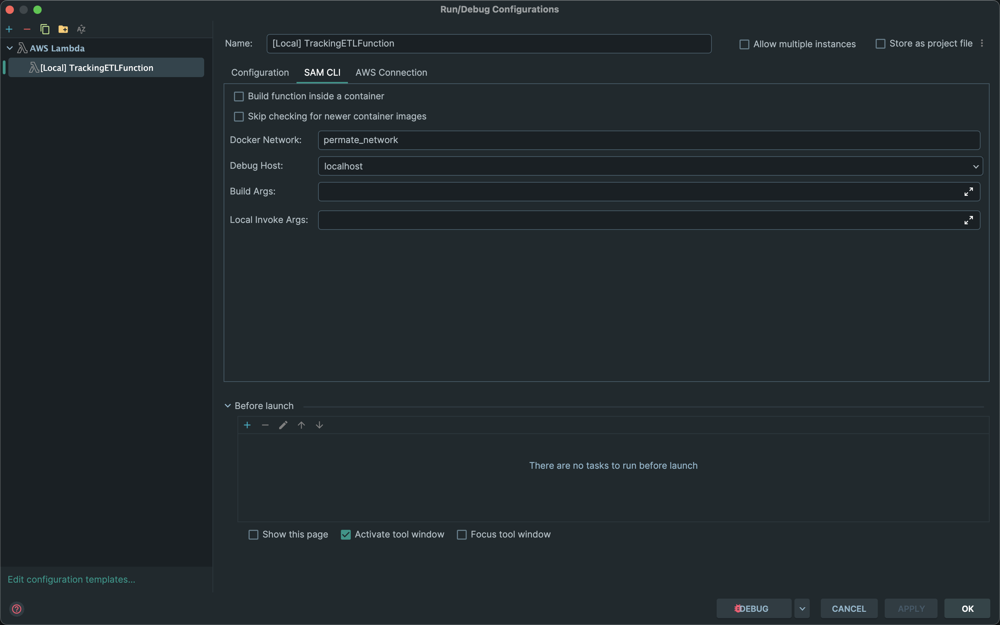
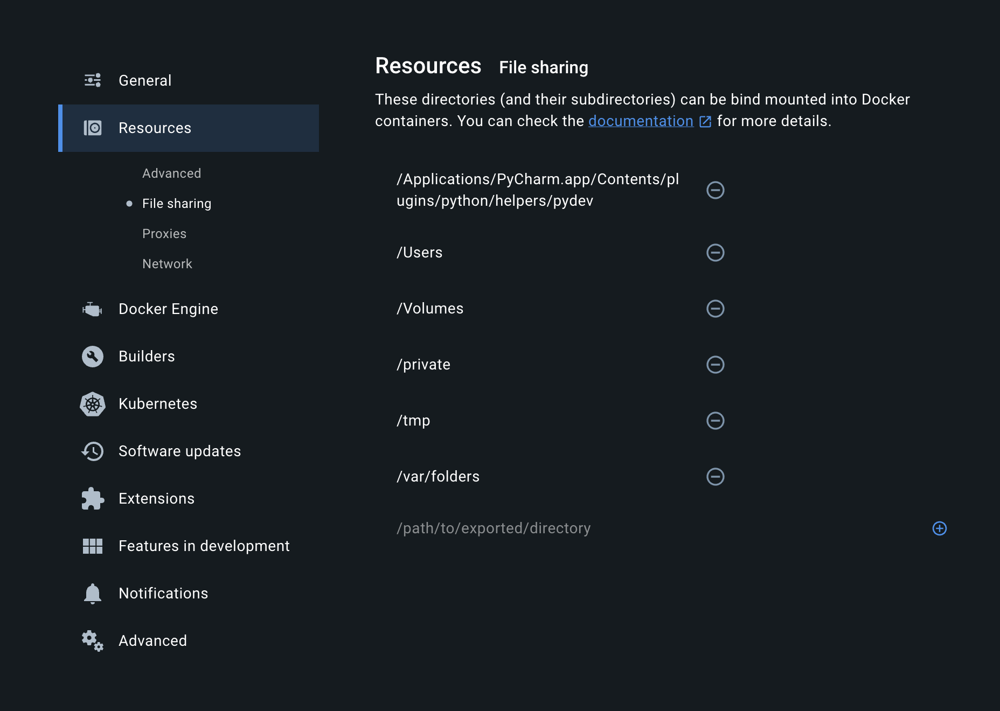

# Debug Idea

## Flask debugging in PyCharm



## Django debugging in PyCharm


Django Setting


## Chalice debugging in PyCharm

- https://github.com/aws/chalice/issues/548
- https://github.com/aws/chalice/issues/873

```shell
local --no-autoreload --host 0.0.0.0 --port 8000
```



## Celery debugging in PyCharm

```shell
-A app.celery worker --scheduler redbeat.RedBeatScheduler -E -B -l info
```



## AWS Serverless Application Model (AWS SAM) debugging in PyCharm




> Fix PyCharm Fail on Debug SAM
> Can't open file /tmp/lambci_debug_files/pydevd.py: [Errno 13] Permission denied

Add path to `Resources » File sharing`
```shell
/Applications/PyCharm.app/Contents/plugins/python/helpers/pydev
```



